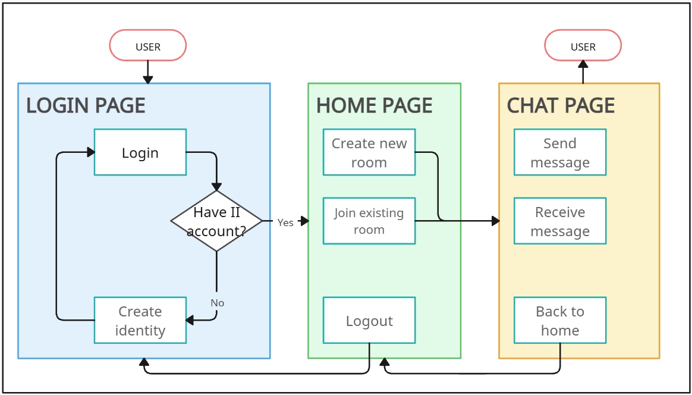

# WCHL Project: WEB3 ANONMESSAGE APP

## Descriptions:
A fully on-chain decentralized anonymous messaging app built on the Internet Computer Protocol (ICP), that uses Internet Identity (II) for authentication, ensuring one identity per device.

Users can create or join unique chat rooms to exchange messages in a censorship-resistant, privacy-focused environment.

The frontend is built with HTML, SCSS, and Vanilla JS with Vite bundler, while the backend leverages Motoko smart contracts.

This app designed to be easy to use and accessible everywhere like other messaging app but untraceable. This app reimagines private messaging as a core building block of the free, open, and decentralized internet. The decentralized media.

## Main features:
- Internet Identity authentication
- Unique room id that can be use by other user to easily join the conversation.
- Easy to use and responsive interface.
- Fully untrackable. 100% anonym.

## Stack:
- Backend: Motoko.
- Frontend: HTML, SCSS, and Vanilla JS with Vite.
- Authentication: Internet Identity (local)

## How to run:
On root directory, type:
- `npm run setup`
- `dfx start --background`
- `dfx deploy`

## Process flow:
